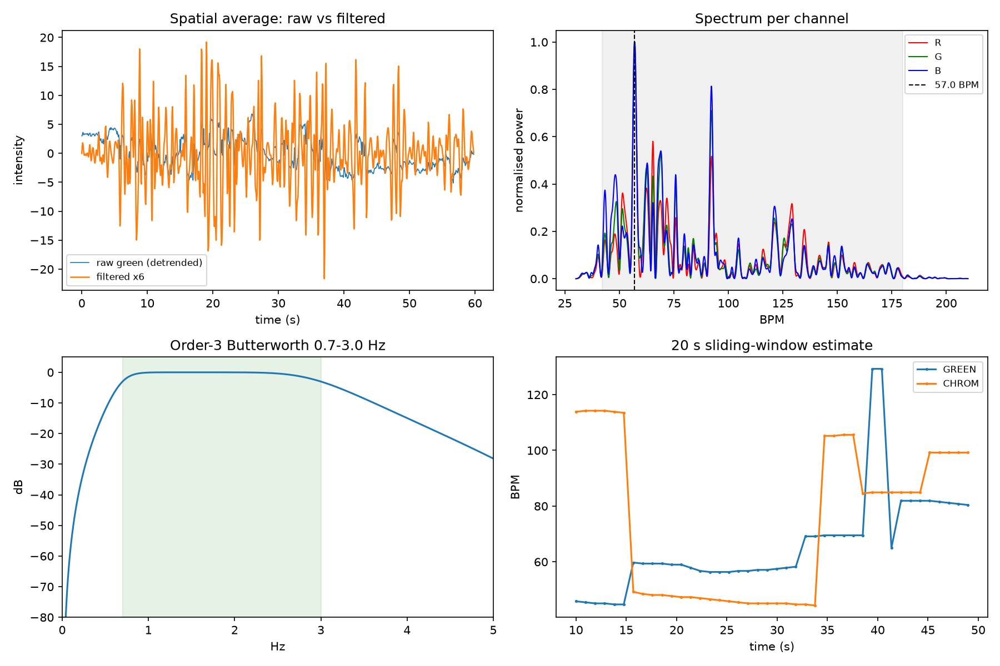

# rPPG — contactless and contact heart-rate monitoring

Measure heart rate from a camera, and check the camera against real sensors.

The repo holds three connected pieces:

1. **Camera rPPG** (remote photoplethysmography). A phone films your face and
   reads the tiny colour change that each heartbeat makes in the skin. A laptop
   shows the live result.
2. **Contact PPG reference.** An ESP32 with a finger pulse sensor gives a
   trustworthy heart rate at the same moment, so the camera can be scored
   against it and a small model can be trained to fix its mistakes.
3. **Contact pulse oximeter.** An ESP32 with a MAX30102 reads heart rate and
   SpO2, sends it over MQTT, and shows it on a web dashboard with history.

> **Not a medical device.** The numbers are for experiments and trends only.
> Do not use them for any health decision.



---

## Contents

- [Repository layout](#repository-layout)
- [Requirements](#requirements)
- [Part 1 — Camera rPPG](#part-1--camera-rppg)
- [Part 2 — Contact reference and learned peak picker](#part-2--contact-reference-and-learned-peak-picker)
- [Part 3 — MAX30102 pulse oximeter](#part-3--max30102-pulse-oximeter)
- [Recorded data](#recorded-data)
- [Troubleshooting](#troubleshooting)

---

## Repository layout

| Path | What it is |
|---|---|
| `server_http.py` | Main rPPG server. Serves the phone and laptop pages, receives live estimates, relays WebRTC signalling, logs data. |
| `index.html` | Landing page: choose **Mobile — Capture** or **PC — Monitor**. |
| `mobile.html` | Phone page. Opens the camera, tracks the face, measures the pulse, streams results. |
| `pc.html` | Laptop page. Live heart rate, waveform, spectrum, face overlay, and error against the reference. |
| `dsp.js` | The signal processing used by the phone page. |
| `rppg.py` | Stand-alone webcam version: record a clip, then analyse it and draw `rppg_report.png`. |
| `live.py` | Prints the live estimates in the terminal (tails `live.jsonl`). |
| `bridge.py` | Reads the contact sensor over USB serial and forwards it to the server. |
| `train.py` | Trains the peak-picking model from paired data and saves `peak_model.pkl`. |
| `eval_split.py` | Tests the model on a raised heart rate after training on a resting one. |
| `server.py` | Older, simpler capture server that only saves `trace.npz`. |
| `wait_tether.py`, `probe.py`, `reset_camera.py` | Helper scripts, see [Troubleshooting](#troubleshooting). |
| `sensor/` | Firmware for the contact PPG reference (XIAO ESP32-C3 + analog pulse sensor + OLED). |
| `firmware/` | Firmware for the MAX30102 pulse oximeter (XIAO ESP32-C3). |
| `broker/` | Mosquitto MQTT broker (Docker). |
| `server/` | Node service for the pulse oximeter: MQTT in, SQLite history, WebSocket out. |
| `web/` | Pulse-oximeter dashboard. |

---

## Requirements

- **Python 3.12** with `numpy`, `scipy`, `matplotlib`, `opencv-python`,
  `scikit-learn`, `pyserial`
- **PlatformIO** to build and flash the ESP32 firmware
- **Node.js 22.5 or newer** for the pulse-oximeter server (it uses the built-in `node:sqlite`)
- **Docker** if you want to run the bundled MQTT broker
- `openssl` to make a local HTTPS certificate

```bash
python3 -m venv .venv
source .venv/bin/activate
pip install numpy scipy matplotlib opencv-python scikit-learn pyserial platformio
```

---

## Part 1 — Camera rPPG

### How it works

```
Phone (mobile.html)                         Laptop (pc.html)
  camera → face mesh → skin patches            live BPM, waveform, spectrum,
  → mean colour → filter → spectrum            face overlay, error vs reference
  → heart rate                                          ▲
        │  POST /live, /geo, /frame                     │  GET /latest, /geo
        ▼                                               │
                    server_http.py  (:8081 HTTP, :8443 HTTPS)
                    also relays WebRTC signalling so video can go phone → laptop directly
```

The phone does all the measuring. The server only passes data between the two
pages and writes it to disk.

### Run it

1. **Make a certificate.** Browsers only allow camera access over HTTPS. Put
   your laptop's LAN IP in place of `192.168.1.20`:

   ```bash
   openssl req -x509 -newkey rsa:2048 -nodes -days 365 \
     -keyout key.pem -out cert.pem -subj /CN=192.168.1.20 \
     -addext "subjectAltName=IP:192.168.1.20,IP:127.0.0.1,DNS:localhost"
   ```

   `key.pem` and `cert.pem` are in `.gitignore`. Never commit the key.

2. **Start the server.**

   ```bash
   python server_http.py
   ```

   It prints the HTTPS address, for example `https://192.168.1.20:8443`.

3. **On the phone** (same Wi-Fi), open that address, accept the certificate
   warning once, and choose **Mobile — Capture**.

4. **On the laptop**, open the same address and choose **PC — Monitor**.

5. Hold still, face the camera, in even light. The first reading appears after
   about 5 seconds and settles over 15 seconds.

To watch the numbers in a terminal instead: `python live.py`.

### Webcam-only version

No phone needed. This records from the laptop webcam and produces a report:

```bash
python rppg.py record --seconds 45     # saves trace.npz
python rppg.py analyse                 # saves rppg_report.png
```

### Signal processing, in short

- **Band:** 0.8–3.0 Hz, which is 48–180 BPM.
- **Where to look:** a face mesh places patches on the forehead and both
  cheeks. More skin pixels means less noise, so the patches are sized
  generously.
- **Skin check:** each pixel is tested in YCbCr colour space, which separates
  skin from hair, walls and wood.
- **Lighting:** the phone screen can glow green. Blood absorbs strongly near
  540 nm, so green light makes the pulse easier to see.
- **White balance off** (webcam version): auto white balance cancels the very
  colour change being measured.
- **Drift removal:** a moving average applied twice. A single pass created a
  false peak at 57 BPM; the double pass removes it.
- **Heart rate:** the strongest peak in the spectrum over a sliding 15 s
  window, with a signal-to-noise figure that decides whether the reading is
  trusted.

---

## Part 2 — Contact reference and learned peak picker

The camera's spectrum usually contains the right answer. Its main failure is
picking the **wrong peak**. A contact sensor worn at the same time shows which
peak was right, and a small model learns to choose better.

### Wiring (`sensor/`)

| Sensor pin | XIAO ESP32-C3 pin | GPIO | Note |
|---|---|---|---|
| Signal (S / A0) | D1 | GPIO3 | ADC input, not a strapping pin |
| VCC (+) | 3V3 | — | 3.3 V only, never 5 V |
| GND (−) | GND | — | |

| OLED (SSD1306, 128×32) | XIAO pin | GPIO |
|---|---|---|
| SDA | D4 | GPIO6 |
| SCL | D5 | GPIO7 |
| VCC | 3V3 | — |
| GND | GND | — |

### Collect, train, test

```bash
cd sensor && pio run -t upload && cd ..      # flash the reference sensor

python server_http.py                        # terminal 1
python bridge.py /dev/ttyACM0                # terminal 2: sensor → server
```

With a finger on the sensor and your face to the phone, every camera estimate
is saved next to the sensor's reading in `paired.jsonl`. About 2 minutes gives
enough data (at least 60 samples).

```bash
python train.py                  # prints error before/after, saves peak_model.pkl
```

`eval_split.py` is the harder test: train on resting data, test after exercise.
It reads the split time (seconds) from `/tmp/split_t`:

```bash
echo 300 > /tmp/split_t
python eval_split.py
```

If the error stays low when heart rate is 40 BPM higher, the model has learned
what a pulse peak looks like, not just your resting rate.

---

## Part 3 — MAX30102 pulse oximeter

A XIAO ESP32-C3 reads a MH-ET LIVE MAX30102 at 100 Hz, works out heart rate and
SpO2 on the board, and publishes over MQTT. A small Node service stores the
history and streams the live data to a browser dashboard.

```
XIAO ESP32C3 ──I2C──> MAX30102        D4/GPIO6 SDA, D5/GPIO7 SCL, 3V3, GND
      │
      │ WiFi + MQTT (JSON)
      ▼
Mosquitto (broker/, Docker)
      ▼
Node server (server/) ── SQLite history ── WebSocket ──> browser (web/)
```

> SpO2 uses an uncalibrated formula. It is fine for trends, not for real
> readings. Calibrate against a certified oximeter before trusting it.

### Quick start

```bash
cd broker && docker compose up -d      # skip if you already run a broker on 1883
cd ../server && npm install && npm start
xdg-open http://localhost:8080
```

No hardware? Run a fake device:

```bash
cd server && node tools/simulate.js --id sim-01 --drop 40
```

`--drop 40` lifts the virtual finger for 8 s every 40 s. The charts should show
a gap rather than join across it, and the tiles should go stale rather than
freeze on the last number.

### Firmware

```bash
cd firmware
cp include/secrets.h.example include/secrets.h     # WiFi + broker address
pio run -t upload
pio device monitor
```

`secrets.h` is gitignored. Three build environments:

| env | what it does | when to use it |
|---|---|---|
| `seeed_xiao_esp32c3` | sensor + WiFi + MQTT | normal use |
| `bringup` | sensor + serial only, radio off | the board keeps rebooting, or you want to test without a network |
| `wifimin` | starts the radio and nothing else | check whether a brownout is the firmware's fault or the power supply's |

At boot the firmware prints its own diagnosis:

```
# reset: brownout (9)                 <- why it last restarted
# SDA/D4: pulled up (device powered on the bus)
# i2c scan @400kHz: 0x57              <- retries at 100 kHz if nothing answers
# max30102: part 0x15 rev 0x03, 100 Hz
# wifi: starting radio                <- last line before a weak supply gives out
```

### MQTT topics

Base topic is `pulseox/<device-id>`. The id comes from the MAC address, for
example `pulseox-b54114`. Timestamps are device milliseconds; the server adds
the real time when a message arrives.

| topic | rate | payload |
|---|---|---|
| `…/status` | on change, retained | `{"state":"online","ip","rssi","fs","fw"}` |
| `…/vitals` | 1 Hz | `{"t","finger","bpm","spo2","pi","r","conf","dc_ir","dc_red","rssi","overflows"}` |
| `…/ppg` | 4 Hz | `{"t","fs":100,"n":25,"ir":[…],"red":[…]}` |

`status` is also the MQTT "last will" (`{"state":"offline"}`), so an unplugged
board shows as offline instead of leaving an old number on screen.

### How the numbers are worked out

All per sample at 100 Hz:

- **DC** (steady level): a slow low-pass filter at about 0.16 Hz.
- **AC** (the pulse): what is left after removing DC, smoothed at about 5 Hz
  and flipped, because more blood means less light returned.
- **Beats:** a peak detector with a 285 ms lock-out that also ignores the
  small second bump in each pulse. BPM is the median of the last 8 beat
  intervals. `conf` counts how many of those 8 are within 20% of the median.
- **SpO2:** `R = (ACred/DCred) / (ACir/DCir)` over one second, then
  `110 − 25R`, limited to a sensible range and smoothed over about 4 s.
- **Finger detection:** IR level above 40 000 means a finger is present; it
  must drop below 25 000 to count as removed. Removing the finger clears every
  value at once, because an old BPM on an empty sensor is misleading.

### Server API

Two dependencies (`mqtt`, `ws`) plus the built-in `node:sqlite`.

| endpoint | returns |
|---|---|
| `GET /api/health` | broker connection, WebSocket client count, uptime |
| `GET /api/devices` | live device state and what is stored |
| `GET /api/history?device=&minutes=` | averaged history |
| `WS /ws` | `snapshot`, `devices`, `vitals`, `ppg` |

History is averaged into buckets sized to the time range, so 24 hours is as
cheap as 10 minutes. Empty buckets are left out rather than stored as zero, so
the dashboard draws a gap instead of a fake reading. The raw waveform is not
stored.

Settings are environment variables; see `server/.env.example`.

### Dashboard

Heart rate and SpO2 each get their own chart, because putting two different
scales on one chart suggests links that aren't there. The waveform scrolls
smoothly even though data arrives in four batches a second. A table under the
charts shows the same data without relying on colour.

---

## Recorded data

Sample recordings are included so the analysis and training scripts can run
without hardware.

| File | Contents |
|---|---|
| `live.jsonl`, `live_session*.jsonl` | Live camera estimates from several sessions (different ROI and resolution settings) |
| `paired.jsonl` | Camera estimates paired with the contact reference; input to `train.py` |
| `paired_rest.jsonl` | Paired data at rest only |
| `trace*.npz` | Raw colour traces from `rppg.py record`, including phone, low-light and synthetic runs |
| `ppg_ref.csv` | Contact-sensor log: `ms,raw,filtered,bpm,beat` |
| `peak_model.pkl` | Trained peak-picking model from `train.py` |
| `rppg_report.png` | Output of `rppg.py analyse` |

---

## Troubleshooting

| Problem | Fix |
|---|---|
| Phone can't open the page | Run `python probe.py` and open `http://<laptop-ip>:8080` on the phone. If it says **REACHABLE**, the network is fine and the problem is HTTPS or the certificate. |
| No shared Wi-Fi | Turn on USB tethering on the phone and run `python wait_tether.py`. It waits for the link, makes a certificate for that IP, and starts `server.py` and `probe.py` on it. |
| Webcam image is black or very dark after a run | Camera settings stay on the device between programs. Run `python reset_camera.py` to put exposure and white balance back on auto. |
| Camera page says no camera | The page must be opened over **https**, not http. |
| Reading jumps between two values | Improve the light, hold still, and check the monitor's SNR. Low SNR readings are shown but not trusted. |
